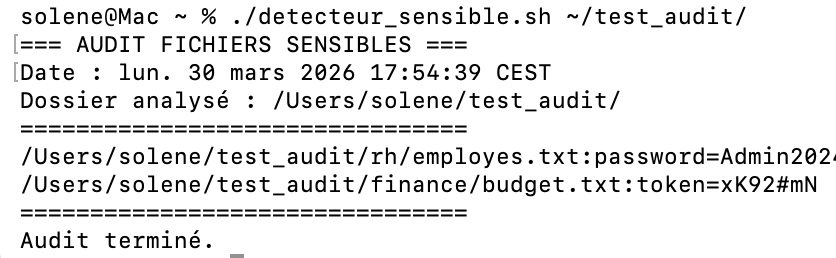

# Détecteur Automatique de Fichiers Sensibles


> **Aperçu visuel de l'audit en cours :**


## Contexte & Sécurité

Script Bash conçu pour l'audit rapide de systèmes de fichiers afin d'identifier des données critiques exposées (mots de passe, tokens, secrets).

**Objectif :** Réduire la surface d'attaque en appliquant les principes du **Privacy by Design** (RGPD Art. 25).

## Fonctionnalités

* Scan récursif de répertoires spécifiques.
* Filtrage par types de fichiers sensibles (`.txt`, `.csv`, `.md`).
* Détection par mots-clés (regex insensibles à la casse).

## Installation et Utilisation

### 1. Récupérer le script

Vous pouvez télécharger directement le script ici : [Télécharger detecteur_sensible.sh](./detecteur_sensible.sh)

### 2. Procédure

```bash
# 1. Donner les droits d'exécution
chmod +x detecteur_sensible.sh

# 2. Lancer l'audit sur un dossier spécifique
./detecteur_sensible.sh /chemin/vers/dossier
