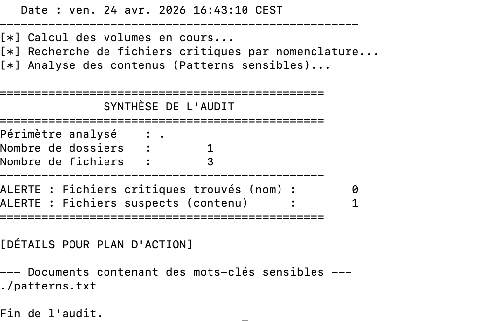

# Diagnostic d’Hygiène Numérique : Détecteur de Fichiers Sensibles


> **Aperçu du rapport d'audit :**


## 🛡️ Contexte & Objectifs GRC

Script Bash d'audit local conçu pour identifier l'exposition de données critiques (secrets, clés, fichiers de configuration) sur un poste de travail.

**Alignement stratégique :**
* **Gestion des Risques :** Identification des vecteurs de fuite de données (Data Leakage).
* **Conformité :** Évaluation de l'application des principes de confidentialité (RGPD) et des directives de la PSSI.
* **Audit :** Simulation de la phase de "Reconnaissance" lors d'un audit interne pour mesurer l'écart entre la politique de sécurité et la réalité du terrain.

## ⚙️ Fonctionnalités

* **Analyse de nomenclature :** Détection de fichiers critiques par dictionnaire (`.env`, `id_rsa`, `config.json`).
* **Scan de contenu :** Recherche de patterns sensibles via regex (mots-clés GRC et techniques).
* **Reporting quantitatif :** Calcul du volume de données analysées vs. nombre d'alertes pour faciliter le pilotage.

## 🚀 Installation et Utilisation

### 1. Préparation de l'environnement
Le script s'appuie sur deux dictionnaires externes pour une maintenance simplifiée. Assurez-vous que ces fichiers sont présents dans le répertoire du script :
* [patterns.txt](./patterns.txt) : Liste des expressions régulières (mots-clés).
* [fichiers_sensibles.txt](./fichiers_sensibles.txt) : Liste des noms de fichiers critiques.

### 2. Procédure d'exécution

```bash
# 1. Accorder les droits d'exécution
chmod +x audit_hygiene.sh

# 2. Lancer l'audit sur le répertoire actuel (ou spécifier un chemin)
./audit_hygiene.sh .
