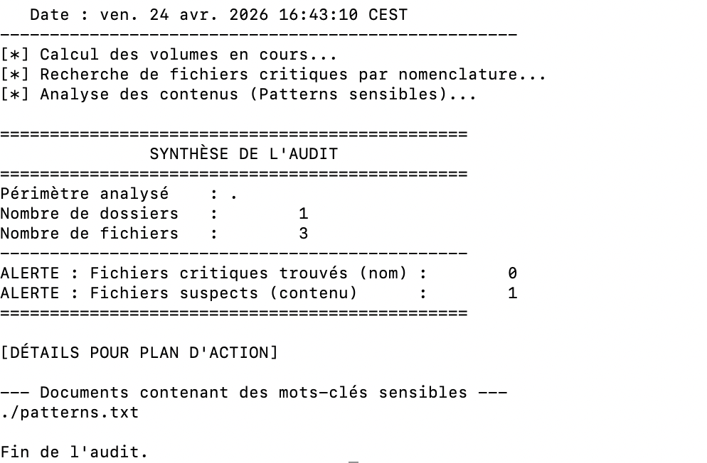

# Diagnostic d'Hygiène Numérique — Détecteur de Fichiers Sensibles
> [](./LICENSE)


> Outil de reconnaissance locale pour l'audit de postes de travail
> Aligné ANSSI · RGPD Art. 5 & 32 · EBIOS RM · ISO 27001 A.8

---

## 🛡️ Contexte & Objectifs GRC

Ce script Bash constitue un **outil de diagnostic de première intention**, conçu pour objectiver l'exposition de données sensibles sur un poste de travail : secrets, clés cryptographiques, fichiers de configuration, dumps de bases de données, données à caractère personnel.

Il s'inscrit dans trois démarches GRC complémentaires :

**Gestion des risques**
Identification des vecteurs d'exfiltration de données au niveau poste, conformément au cadre EBIOS RM (caractérisation des sources de menace et des biens supports). Les alertes produites alimentent une évaluation qualitative du niveau d'exposition et peuvent être intégrées à un registre des risques existant.

**Conformité**
Évaluation de l'application du principe de minimisation (RGPD, Art. 5) et des mesures techniques de protection des données (RGPD, Art. 32). Alignement avec les recommandations de durcissement des postes de travail publiées par l'ANSSI (*Guide de configuration d'un poste de travail sécurisé*) et les contrôles de l'ISO 27001 en matière de gestion des actifs (A.8).

**Audit interne & sensibilisation**
Simulation de la phase de découverte locale (MITRE ATT&CK TA0007 — Discovery) lors d'un audit interne, pour mesurer l'écart entre la politique de sécurité formalisée (PSSI) et les pratiques réelles sur le terrain. Utilisable en atelier de sensibilisation pour rendre concrets les risques liés aux habitudes de stockage.

---

## ⚙️ Fonctionnalités

**Analyse de nomenclature**
Détection de fichiers critiques par correspondance exacte sur un dictionnaire de noms : `.env`, `id_rsa`, `config.json`, `dump.sql`, etc. La liste est entièrement configurable via [`fichiers_sensibles.txt`](./fichiers_sensibles.txt) pour s'adapter au contexte (postes de dev, machines d'admin, postes utilisateurs).

**Scan de contenu**
Recherche de patterns sensibles par expressions régulières sur le contenu des fichiers texte. Deux catégories de mots-clés, configurables via [`patterns.txt`](./patterns.txt) :

- **Techniques** : `token`, `password`, `secret_key`, `api_key`, `private_key`, `access_token`…
- **GRC** : `PII`, `données personnelles`, `RGPD`, `HDS`, `confidentiel`, `diffusion restreinte`…

**Reporting orienté pilotage**
Production d'indicateurs quantitatifs à l'issue du scan :

- volume de fichiers analysés,
- nombre d'alertes par catégorie (nomenclature / contenu),
- chemins complets des fichiers concernés.

Ces métriques constituent une base pour un tableau de bord d'hygiène numérique, un reporting RSSI ou un relevé de constatations lors d'un audit.


> **Aperçu du rapport d'audit :**

---

## ⚠️ Limites & Précautions d'usage

La crédibilité d'un outil d'audit repose autant sur ce qu'il **ne fait pas** que sur ce qu'il fait. Les limites suivantes doivent être documentées explicitement dans tout rapport ou relevé de constatations :

- **Périmètre de scan** : parcours récursif à partir du répertoire cible uniquement. Les chemins montés, partages réseau (NFS, SMB), volumes chiffrés et conteneurs ne sont pas couverts sauf inclusion explicite dans le chemin passé en argument.
- **Faux positifs** : la détection par regex sur le contenu ne dispose d'aucun contexte sémantique. Une revue manuelle des alertes est indispensable avant toute conclusion ou remontée dans un rapport.
- **Fichiers non textuels** : les fichiers binaires (images, archives chiffrées, bases SQLite, fichiers Office) ne sont pas analysés en contenu. Seule la nomenclature est contrôlée pour ces types.
- **Droits d'accès** : le script s'exécute avec les droits de l'utilisateur courant. Les fichiers protégés en lecture sont silencieusement ignorés — cette limite doit être signalée si le scan est réalisé sans élévation de privilèges.
- **Non-substitution à un outil certifié** : cet outil est un support de diagnostic, de sensibilisation et d'audit interne. Il ne se substitue pas à un scanner de conformité certifié (DLP, CASB) ni à une analyse forensique.

---

## 🚀 Installation & Utilisation

### Prérequis

- Bash ≥ 4.0
- `grep` avec support des expressions régulières étendues POSIX (`-E`)
- Droits de lecture sur le répertoire cible

### 1. Préparation de l'environnement

Deux dictionnaires externes sont nécessaires. Placez-les dans le même répertoire que le script :

- [`patterns.txt`](./patterns.txt) — Expressions régulières pour le scan de contenu (mots-clés techniques et GRC).
- [`fichiers_sensibles.txt`](./fichiers_sensibles.txt) — Noms de fichiers considérés comme critiques.

Ces fichiers sont fournis à titre d'exemple et doivent être adaptés au contexte de votre organisation (secteur, référentiel de classification, environnement technique).

### 2. Procédure d'exécution

```bash
# Accorder les droits d'exécution
chmod +x audit_hygiene.sh

# Lancer l'audit sur le répertoire courant
./audit_hygiene.sh .

# Ou sur un chemin spécifique
./audit_hygiene.sh /home/utilisateur/projets
```

Le script parcourt récursivement le répertoire cible, contrôle la nomenclature des fichiers, analyse le contenu des fichiers texte, puis produit un rapport synthétique en sortie standard.

---

## 🔎 Cas d'usage GRC

### Poste de développeur

Risques couverts : présence de fichiers `.env` en clair, clés privées (`id_rsa`), dumps de base de données, tokens d'API committés localement.

Risques associés : fuite de secrets, compromission de comptes de service, exposition de données à caractère personnel (PII).

Contrôles recommandés : politique de gestion des secrets (coffre-fort de type HashiCorp Vault ou équivalent), intégration de hooks pre-commit (`git-secrets`, `truffleHog`), revue des pratiques de stockage local.

### Poste d'administration / infogérance

Risques couverts : fichiers de configuration d'équipements, scripts d'administration contenant des credentials, exports de journaux ou d'annuaires.

Risques associés : escalade de privilèges, accès non autorisé à des environnements sensibles ou de production, compromission de comptes d'administration.

Contrôles recommandés : durcissement des postes d'admin (référentiel ANSSI), séparation des environnements d'administration, journalisation des accès, revue des privilèges.

### Sensibilisation des utilisateurs

Utilisation en atelier pour rendre concrets les risques liés aux habitudes de stockage : mots de passe dans des fichiers texte, exports de données RH ou financières, fichiers de configuration partagés hors canal sécurisé.

Support pour des messages de sensibilisation ciblés et des plans d'action "bonne hygiène numérique" (guides utilisateurs, campagnes de phishing simulé, ateliers PSSI).

### Aller plus loin

Ce mini-projet s’inscrit dans une démarche plus large de documentation **technique → gouvernance** portée par le dépôt [Cyber-Ops Logbook](https://github.com/solenefig-lab/Cyber-Ops-Logbook).

Pour relier ces gestes d’audit locaux (détection de secrets, reconnaissance de configuration, recherche de fichiers sensibles) à des pratiques plus générales :

- le **Technical Security Review Playbook** de Cyber-Ops Logbook mappe chaque commande d’audit à l’indice recherché, au risque potentiel et au contrôle GRC concerné ;
- le **Panorama des patterns de risques** consolide les vulnérabilités récurrentes (exposition de secrets, gestion des privilèges, cryptographic failures) en familles de risques exploitables en audit et gouvernance.

#### Cas d’usage PME e-santé (SantéConnect)

Dans le projet [SantéConnect - Démarche GRC complète pour une PME e-santé](https://github.com/solenefig-lab/grc-pme-fictive), ce type d’outil peut être utilisé comme :

- entrée technique pour la **cartographie des actifs** (poste de dev, poste d’admin, machine d’exploitation) et la localisation des données sensibles ;
- levier pour prioriser les **contrôles ISO 27001 / NIS2** applicables aux PME (gestion des secrets, durcissement des postes, journalisation) ;
- support à la **réponse aux incidents** et aux exercices de préparation (identifier rapidement les zones d’exposition sur un poste lors d’une suspicion de fuite).

Les modèles et guides de la [bibliothèque de ressources SantéConnect](https://github.com/solenefig-lab/grc-pme-fictive/tree/main/ressources) (inventaire d’actifs, contrôles ISO 27001 priorisés, PRI, correspondances NIS2) peuvent compléter ce script pour formaliser les décisions de gouvernance et les plans d’action.

---

## 🇬🇧 English Summary

> **Local hygiene audit: detecting sensitive files and supporting governance decisions.**

This Bash script performs a local hygiene check by scanning a directory for sensitive files (secrets, keys, configurations, PII) using two configurable dictionaries (`patterns.txt` and `fichiers_sensibles.txt`).

It is designed to:

- identify potential **data exfiltration vectors** on workstations (developers, admins, end users),
- support **risk and compliance** efforts aligned with RGPD Art. 32, ANSSI hardening guidelines, and ISO 27001 A.8,
- simulate a **local discovery phase** (MITRE ATT&CK TA0007) during internal audits and awareness sessions.

Output metrics (files scanned, alerts by category, affected paths) provide a starting point for governance decisions: workstation hardening, secret management improvement, and awareness campaign design.

Documented limitations: text files only for content scanning, current-user permissions, no coverage of network shares or encrypted volumes.

---

## 🤝 Open for contributions

Suggestions, improvements and discussions are welcome via Issues and Pull Requests.

Types of contributions that make sense for this project include:

- enrichir ou adapter les dictionnaires `patterns.txt` et `fichiers_sensibles.txt` à d’autres contextes (PME, dev, cloud, admin) ;
- améliorer le script (performance, options de filtrage, formats de rapport) tout en conservant une dépendance minimale ;
- proposer des exemples de lectures GRC supplémentaires (nouveaux cas d’usage, liens vers contrôles ISO/NIS2, intégration dans des ateliers de sensibilisation).

Merci de respecter une posture responsable :
- ne pas utiliser ce script pour collecter ou transmettre des données réelles hors du périmètre autorisé ;
- ne pas proposer de fonctionnalités visant à exfiltrer des données ou contourner des contrôles en production ;
- privilégier une utilisation en environnement de test, d’audit interne ou de sensibilisation.

---

## ⚖️ Licence

Le code de ce dépôt (`audit_hygiene.sh` et scripts associés) est distribué sous licence **MIT**.

Les fichiers de configuration et dictionnaires (`patterns.txt`, `fichiers_sensibles.txt`) sont fournis à titre d'exemples et peuvent être librement adaptés à votre contexte organisationnel.

Voir le fichier [`LICENSE`](./LICENSE-MIT) pour les termes complets.

© 2026 Solène Figueiredo


